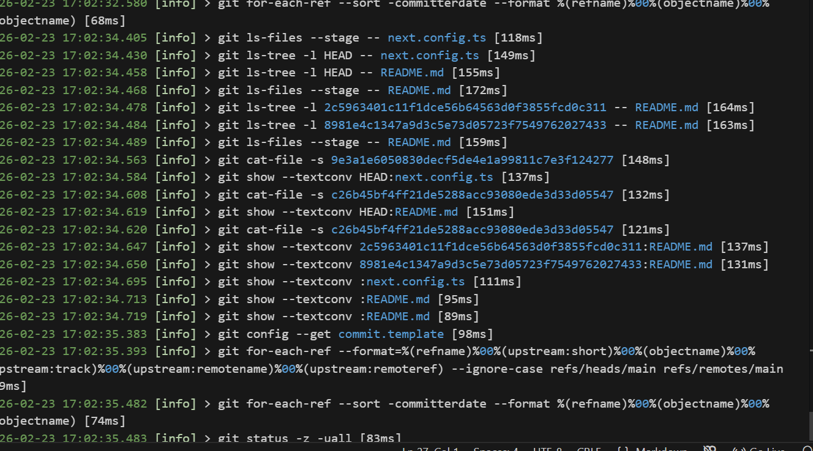

First, run the development server:

Open [http://localhost:3000](http://localhost:3000) with your browser to see the result.

You can start editing the page by modifying `app/page.tsx`. The page auto-updates as you edit the file.

This project uses [`next/font`](https://nextjs.org/docs/app/building-your-application/optimizing/fonts) to automatically optimize and load [Geist](https://vercel.com/font), a new font family for Vercel.

## Learn Mor 

To learn more about Next.js, take a look at the following resources:

- [Next.js Documentation](https://nextjs.org/docs) - learn about Next.js features and API.
- [Learn Next.js](https://nextjs.org/learn) - an interactive Next.js tutorial.

You can check out [the Next.js GitHub repository](https://github.com/vercel/next.js) - your feedback and contributions are welcome!

Nameservers
Nameservers handle internet requests for your domain. You can use Hostinger nameservers or use custom nameservers to point to other hosting provider.
ns1.dns-parking.com

ns2.dns-parking.com

Manage DNS records
These records define how your domain behaves. Common uses include pointing your domain at web servers or configuring email delivery for your domain.
Type
Type
A
Name
Name
@

Points to
TTL
TTL
14400

Add Record
Search
Type
Name
Priority
Content
TTL
TXT	google._domainkey	0	"v=DKIM1; k=rsa; p=MIIBIjANBgkqhkiG9w0BAQEFAAOCAQ8AMIIBCgKCAQEAmRxgDna6fjM+a75TyKocIPskzvT8yNPvLVQpyVxUJGthE6DV7st4eHuBX9R+e82uIrN09FpoSQBvryx/pvm13ptv2QMmuAgO4P1BwO3dEcRZnibXatRyxtfLvhXnFkEZqS7nhayUgMnduDLXOtE6pkchvabQzgKZWJrrqxNEEmbsGXW77FXksbz67JKm6nqIDaTrfSC1ks31yv/IzDorM13ii8hs2JHSi9xYSOOADIw3VTmroUvPb8066uExtzxPVCnK+LtsSFgj759gpirXWiJj53uBHw9pWwlS0n37R/UQZNZsZflBDTpadmElk1Phe1yZw6J6v5oSvW+h1NjROQIDAQAB"	3600	
Delete
Edit
CNAME	www	0	thomesinfra.com	300	
Delete
Edit
CNAME	autodiscover	0	autodiscover.mail.hostinger.com	300	
Delete
Edit
A	ftp	0	82.25.107.20	1800	
Delete
Edit
CNAME	autoconfig	0	autoconfig.mail.hostinger.com	300	
Delete
Edit
TXT	_dmarc	0	"v=DMARC1; p=quarantine; rua=mailto:postmaster@thomesinfra.com; ruf=mailto:postmaster@thomesinfra.com; pct=100; sp=quarantine"	3600	
Delete
Edit
ALIAS	@	0	thomesinfra.com.cdn.hstgr.net	300	
Delete
Edit
CAA	@	0	0 issuewild "pki.goog"	14400	
Delete
Edit
CAA	@	0	0 issuewild "letsencrypt.org"	14400	
Delete
Edit
CAA	@	0	0 issue "sectigo.com"	14400	
Delete
Edit
CAA	@	0	0 issue "comodoca.com"	14400	
Delete
Edit
CAA	@	0	0 issue "digicert.com"	14400	
Delete
Edit
CAA	@	0	0 issue "globalsign.com"	14400	
Delete
Edit
CAA	@	0	0 issue "letsencrypt.org"	14400	
Delete
Edit
CAA	@	0	0 issue "pki.goog"	14400	
Delete
Edit
CAA	@	0	0 issuewild "comodoca.com"	14400	
Delete
Edit
CAA	@	0	0 issuewild "digicert.com"	14400	
Delete
Edit
CAA	@	0	0 issuewild "globalsign.com"	14400	
Delete
Edit
CAA	@	0	0 issuewild "sectigo.com"	14400	
Delete
Edit
TXT	@	0	"v=spf1 include:_spf.google.com ~all"	3600	
Delete
Edit
MX	@	1	ASPMX.L.GOOGLE.COM	3600	
Delete
Edit
MX	@	10	ALT3.ASPMX.L.GOOGLE.COM	3600	
Delete
Edit
MX	@	10	ALT4.ASPMX.L.GOOGLE.COM	3600	
Delete
Edit
MX	@	5	ALT1.ASPMX.L.GOOGLE.COM	3600	
Delete
Edit
MX	@	5	ALT2.ASPMX.L.GOOGLE.COM	3600	
Delete
Edit
Reset DNS records
This feature resets all existing DNS records of thomesinfra.com to default."# Thomesinfra" 
TXT	google._domainkey	0	"v=DKIM1; k=rsa; p=MIIBIjANBgkqhkiG9w0BAQEFAAOCAQ8AMIIBCgKCAQEAmRxgDna6fjM+a75TyKocIPskzvT8yNPvLVQpyVxUJGthE6DV7st4eHuBX9R+e82uIrN09FpoSQBvryx/pvm13ptv2QMmuAgO4P1BwO3dEcRZnibXatRyxtfLvhXnFkEZqS7nhayUgMnduDLXOtE6pkchvabQzgKZWJrrqxNEEmbsGXW77FXksbz67JKm6nqIDaTrfSC1ks31yv/IzDorM13ii8hs2JHSi9xYSOOADIw3VTmroUvPb8066uExtzxPVCnK+LtsSFgj759gpirXWiJj53uBHw9pWwlS0n37R/UQZNZsZflBDTpadmElk1Phe1yZw6J6v5oSvW+h1NjROQIDAQAB"	3600	
Delete
Edit
CNAME	www	0	thomesinfra.com	300	
Delete
Edit
CNAME	autodiscover	0	autodiscover.mail.hostinger.com	300	
Delete
Edit
A	ftp	0	82.25.107.20	1800	
Delete
Edit
CNAME	autoconfig	0	autoconfig.mail.hostinger.com	300	
Delete
Edit
TXT	_dmarc	0	"v=DMARC1; p=quarantine; rua=mailto:postmaster@thomesinfra.com; ruf=mailto:postmaster@thomesinfra.com; pct=100; sp=quarantine"	3600	
Delete
Edit
ALIAS	@	0	thomesinfra.com.cdn.hstgr.net	300	
Delete
Edit
CAA	@	0	0 issuewild "pki.goog"	14400	
Delete
Edit
CAA	@	0	0 issuewild "letsencrypt.org"	14400	
Delete
Edit
CAA	@	0	0 issue "sectigo.com"	14400	
Delete
Edit
CAA	@	0	0 issue "comodoca.com"	14400	
Delete
Edit
CAA	@	0	0 issue "digicert.com"	14400	
Delete
Edit
CAA	@	0	0 issue "globalsign.com"	14400	
Delete
Edit
CAA	@	0	0 issue "letsencrypt.org"	14400	
Delete
Edit
CAA	@	0	0 issue "pki.goog"	14400	
Delete
Edit
CAA	@	0	0 issuewild "comodoca.com"	14400	
Delete
Edit
CAA	@	0	0 issuewild "digicert.com"	14400	
Delete
Edit
CAA	@	0	0 issuewild "globalsign.com"	14400	
Delete
Edit
CAA	@	0	0 issuewild "sectigo.com"	14400	
Delete
Edit
TXT	@	0	"v=spf1 include:_spf.google.com ~all"	3600	
Delete
Edit
MX	@	1	ASPMX.L.GOOGLE.COM	3600	
Delete
Edit
MX	@	10	ALT3.ASPMX.L.GOOGLE.COM	3600	
Delete
Edit
MX	@	10	ALT4.ASPMX.L.GOOGLE.COM	3600	
Delete
Edit
MX	@	5	ALT1.ASPMX.L.GOOGLE.COM	3600	
Delete
Edit
MX	@	5	ALT2.ASPMX.L.GOOGLE.COM	3600	
Delete
Edit

BEFORE1 
NAME	hostingermail-c._domainkey	0	hostingermail-c.dkim.mail.hostinger.com	300	
Delete
Edit
CNAME	hostingermail-b._domainkey	0	hostingermail-b.dkim.mail.hostinger.com	300	
Delete
Edit
CNAME	hostingermail-a._domainkey	0	hostingermail-a.dkim.mail.hostinger.com	300	
Delete
Edit
CNAME	www	0	www.thomesinfra.com.cdn.hstgr.net	300	
Delete
Edit
CNAME	autodiscover	0	autodiscover.mail.hostinger.com	300	
Delete
Edit
CNAME	autoconfig	0	autoconfig.mail.hostinger.com	300	
Delete
Edit
TXT	_dmarc	0	"v=DMARC1; p=none"	3600	
Delete
Edit
ALIAS	@	0	thomesinfra.com.cdn.hstgr.net	300	
Delete
Edit
TXT	@	0	"v=spf1 include:_spf.google.com ~all"	3600	
Delete
Edit
MX	@	5	ALT2.ASPMX.L.GOOGLE.COM	3600	
Delete
Edit
MX	@	1	ASPMX.L.GOOGLE.COM	3600	
Delete
Edit
MX	@	10	ALT3.ASPMX.L.GOOGLE.COM	3600	
Delete
Edit
MX	@	10	ALT4.ASPMX.L.GOOGLE.COM	3600	
Delete
Edit
MX	@	10	mx2.hostinger.com	3600	
Delete
Edit
MX	@	5	ALT1.ASPMX.L.GOOGLE.COM	3600	
Delete
Edit
MX	@	5	mx1.hostinger.com	3600	
Delete
Edit

Type
Name
Priority
Content
TTL
CNAME	hostingermail-c._domainkey	0	hostingermail-c.dkim.mail.hostinger.com	300	
Delete
Edit
CNAME	hostingermail-b._domainkey	0	hostingermail-b.dkim.mail.hostinger.com	300	
Delete
Edit
CNAME	hostingermail-a._domainkey	0	hostingermail-a.dkim.mail.hostinger.com	300	
Delete
Edit
CNAME	www	0	www.thomesinfra.com.cdn.hstgr.net	300	
Delete
Edit
AAAA	thomes	0	2a02:4780:11:1978:0:10c7:62ca:2	1800	
Delete
Edit
A	thomes	0	82.25.107.20	1800	
Delete
Edit
CNAME	autodiscover	0	autodiscover.mail.hostinger.com	300	
Delete
Edit
CNAME	autoconfig	0	autoconfig.mail.hostinger.com	300	
Delete
Edit
TXT	_dmarc	0	"v=DMARC1; p=none"	3600	
Delete
Edit
ALIAS	@	0	thomesinfra.com.cdn.hstgr.net	300	
Delete
Edit
TXT	@	0	"v=spf1 include:_spf.google.com ~all"	3600	
Delete
Edit
MX	@	10	ALT3.ASPMX.L.GOOGLE.COM	3600	
Delete
Edit
MX	@	10	ALT4.ASPMX.L.GOOGLE.COM	3600	
Delete
Edit
MX	@	5	ALT1.ASPMX.L.GOOGLE.COM	3600	
Delete
Edit
MX	@	5	ALT2.ASPMX.L.GOOGLE.COM	3600	
Delete
Edit
MX	@	1	ASPMX.L.GOOGLE.COM	3600	
Delete
Edit
